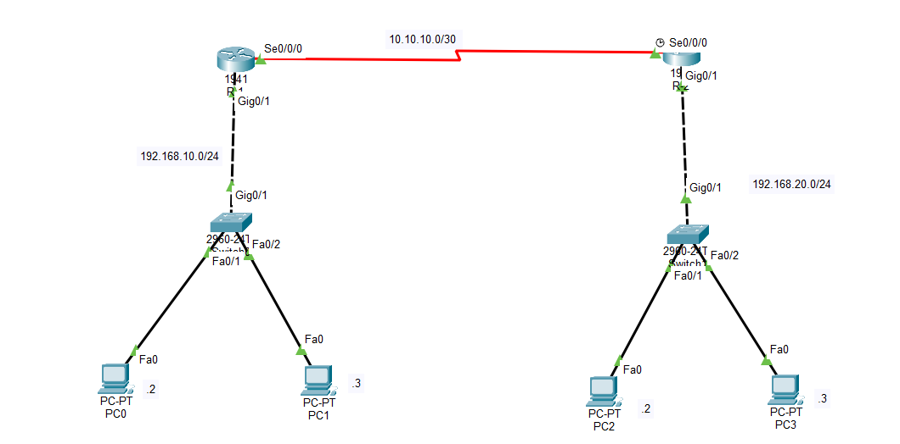

# CCNA Lab 02 – Static Routing with Multiple Networks

## Objective
The objective of this lab is to configure **Static Routing between two routers** so that devices in different LAN networks can communicate with each other.

This lab demonstrates how routers forward traffic between remote networks using manually configured static routes.

---

## Topology



### Network Design

- **Router R1 LAN:** 192.168.10.0/24  
- **Router R2 LAN:** 192.168.20.0/24  
- **Serial Link:** 10.10.10.0/30  

Devices Used:

- 2 Routers  
- 2 Switches  
- 4 PCs  

---

## IP Addressing Table

| Device | Interface | IP Address | Subnet Mask |
|------|------|------|------|
| R1 | Fa0/0 | 192.168.10.1 | 255.255.255.0 |
| R1 | Se0/0/0 | 10.10.10.1 | 255.255.255.252 |
| R2 | Fa0/0 | 192.168.20.1 | 255.255.255.0 |
| R2 | Se0/0/0 | 10.10.10.2 | 255.255.255.252 |
| PC1 | NIC | 192.168.10.2 | 255.255.255.0 |
| PC2 | NIC | 192.168.10.3 | 255.255.255.0 |
| PC3 | NIC | 192.168.20.2 | 255.255.255.0 |
| PC4 | NIC | 192.168.20.3 | 255.255.255.0 |

### Default Gateway

- **LAN 1:** 192.168.10.1  
- **LAN 2:** 192.168.20.1  

---

## Static Route Configuration

To allow communication between both LAN networks, static routes are configured on each router.

**Router R1**
```
ip route 192.168.20.0 255.255.255.0 10.10.10.2
```

**Router R2**
```
ip route 192.168.10.0 255.255.255.0 10.10.10.1
```

---

## Verification

Check routing table:

```
show ip route
```

Test connectivity:

```
ping 192.168.20.2
ping 192.168.10.2
```

Successful ping replies confirm that the static routing configuration is working correctly.

---

## Key Learning

- Understanding **Static Routing**
- Communication between **multiple LAN networks**
- Using **Serial WAN links between routers**
- Verifying connectivity using **ping and routing tables**

---

## Conclusion

Static routing is useful in small and stable networks where routes rarely change.  
This lab helps build a strong foundation before learning dynamic routing protocols such as **OSPF, EIGRP, or RIP**.

---

Consistency beats talent.  
Practicing real-world networking labs daily. 💪
