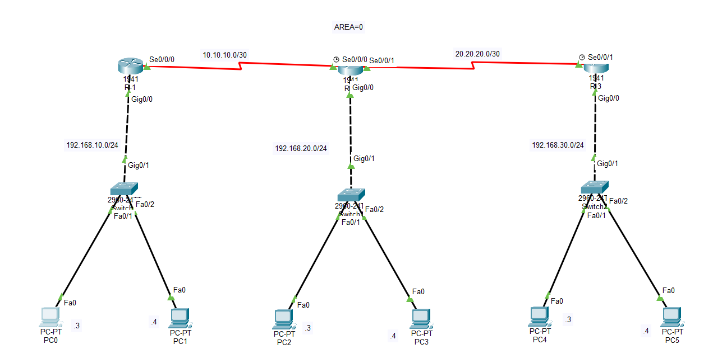

# CCNA Lab 03 – OSPF Multi-Router Topology

## Lab Overview

This lab demonstrates the configuration of OSPF (Open Shortest Path First) dynamic routing protocol in a multi-router environment.

Three routers are connected using serial links, and each router connects to its own LAN network through a switch and PCs.  
The goal of this lab is to establish dynamic routing between all networks using OSPF Area 0 and verify end-to-end connectivity.

--------------------------------------------------

## Network Topology

--------------------------------------------------

## Network Design

Devices used in this lab:

• 3 Routers  
• 3 Switches  
• 6 PCs  
• 2 Serial WAN Links  
• 3 LAN Networks  

Routers exchange routing information dynamically using OSPF Process ID 1.

--------------------------------------------------

## IP Addressing Plan

LAN Networks

192.168.10.0/24 → Gateway 192.168.10.1  
192.168.20.0/24 → Gateway 192.168.20.1  
192.168.30.0/24 → Gateway 192.168.30.1  

WAN Networks

R1 – R2 → 10.10.10.0/30  
R2 – R3 → 20.20.20.0/30  

--------------------------------------------------

## OSPF Configuration

OSPF is configured on all routers using Process ID 1 and Area 0.

router ospf 1  
network 192.168.10.0 0.0.0.255 area 0  
network 192.168.20.0 0.0.0.255 area 0  
network 192.168.30.0 0.0.0.255 area 0  

All routers participate in the Backbone Area (Area 0).

--------------------------------------------------

## OSPF Features Demonstrated

Dynamic Routing  
OSPF Neighbor Adjacency  
Route Advertisement  
Multi-Router Communication  
End-to-End Connectivity  

--------------------------------------------------

## Verification Commands

show ip route  
show ip ospf neighbor  
show ip ospf interface  

Connectivity can also be tested using ping between PCs in different networks.

--------------------------------------------------

## Lab Result

After configuring OSPF, all routers successfully exchanged routes dynamically.

All LAN networks can communicate with each other.

Example

PC0 → PC5 : Ping Successful  
PC1 → PC4 : Ping Successful  

--------------------------------------------------

## Lab Files

topology.png  
configuration.txt  
README.md  

--------------------------------------------------

## Skills Practiced

Cisco Router Configuration  
OSPF Dynamic Routing  
Serial Interface Configuration  
Network Troubleshooting  
Routing Verification  

--------------------------------------------------

## Author

Shivam Kumar

CCNA Networking Labs  
Learning Networking Through Practical Labs
