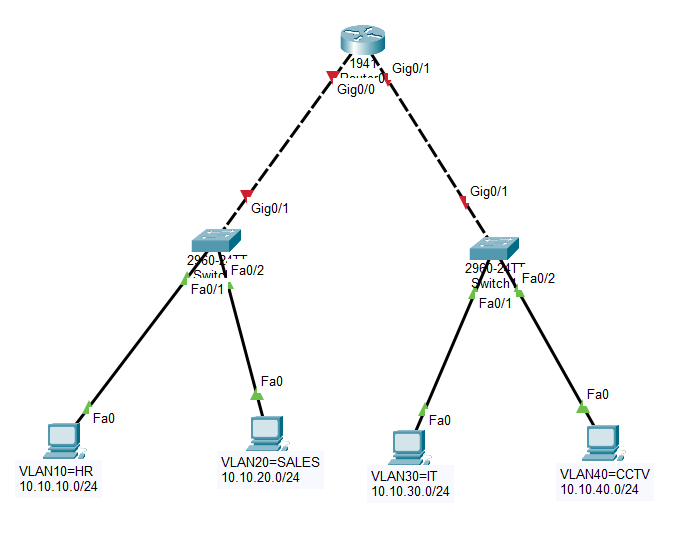

# CCNA Lab 06 — Campus Network (VLAN + Inter-VLAN + DHCP + ACL)

## Lab Overview
This lab simulates a **Company Campus Network** where different departments are separated using VLANs.  
The network also implements **Inter-VLAN routing, DHCP for automatic IP assignment, and ACL-based security** to isolate the CCTV network.

The objective of this lab is to understand how **enterprise networks use segmentation and access control** to improve security and network management.

---

## Topology

## Network Addressing

Router (R1) is connected to two switches using trunk links.

Department networks are separated using VLANs:

VLAN | Department | Network
---- | ---------- | -------
10 | HR | 10.10.10.0/24
20 | IT | 10.10.20.0/24
30 | SALES | 10.10.30.0/24
40 | CCTV | 10.10.40.0/24

Router performs **Inter-VLAN routing using Router-on-a-Stick**.

---

## Features Implemented

### 1️⃣ VLAN Segmentation
Each department is placed in a separate VLAN to isolate broadcast domains.

### 2️⃣ Inter-VLAN Routing
Router subinterfaces allow communication between different VLANs.

### 3️⃣ DHCP Server
The router acts as a **DHCP server** to automatically assign IP addresses to PCs.

### 4️⃣ Trunk Links
Trunk links carry multiple VLANs between switches and router.

### 5️⃣ ACL Security
The CCTV network is restricted for security purposes.

Restrictions applied to VLAN40:

- Cannot access HR network
- Cannot access IT network
- Cannot access SALES network
- Cannot access the Internet
- Can only reach its gateway

This simulates **real-world surveillance network isolation**.

---

## Connectivity Verification

Tests performed:

✔ PCs received IP addresses automatically via DHCP  
✔ Inter-VLAN communication successful  
✔ ACL successfully blocked restricted traffic  
✔ Only permitted traffic allowed  

Example tests:
PC-HR → PC-IT = SUCCESS
PC-HR → PC-SALES = SUCCESS
PC-CCTV → PC-HR = BLOCKED
PC-CCTV → PC-IT = BLOCKED
PC-CCTV → Gateway = ALLOWED

---

## Skills Practiced

- VLAN Configuration
- Access Port Assignment
- Trunk Configuration
- Router-on-a-Stick
- DHCP Configuration
- Access Control Lists (ACL)
- Network Troubleshooting

---

## Tools Used

- Cisco Packet Tracer
- Cisco IOS CLI
- Basic Networking Concepts

---

## Author

**Shivam Kumar Sinha**

GitHub:  
https://github.com/Shivam-azure-network-labs
https://www.linkedin.com/feed/update/urn:li:activity:7435571410422460417/

This repository is part of my **CCNA Networking Labs Series** where I practice real-world networking scenarios.
