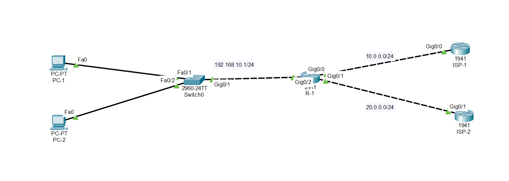

# CCNA Lab 07 — Static Route + Floating Static Route + Default Route (Internet Failover)

## Lab Overview

This lab demonstrates **automatic Internet failover** using Static Routing techniques.
The network is designed so that a router can **switch to a backup ISP automatically** when the primary internet connection fails.

In real enterprise environments, **high availability and uptime are critical**, so backup paths are configured to avoid network downtime.

---

## Topology

---

## Network Scenario

The network consists of a branch router connected to **two Internet Service Providers (ISPs)**.

* **ISP1 → Primary Internet Connection**
* **ISP2 → Backup Internet Connection**

The router uses a **Default Route for internet access** and a **Floating Static Route** as a backup path.

When the primary ISP becomes unavailable, the router automatically switches to the backup ISP.

---

## Network Topology

Device Connections:

R1 → ISP1 (Primary Link)
R1 → ISP2 (Backup Link)

Example Networks:

| Network        | Description               |
| -------------- | ------------------------- |
| 192.168.1.0/24 | Branch LAN                |
| 10.0.12.0/30   | Link between R1 and ISP1  |
| 10.0.13.0/30   | Link between R1 and ISP2  |
| 8.8.8.8        | Simulated Internet Server |

---

## Key Concepts Practiced

### 1️⃣ Default Route

The router sends all unknown traffic to the internet using:

0.0.0.0/0

### 2️⃣ Primary Static Route

Primary internet path configured with **Administrative Distance = 1**.

### 3️⃣ Floating Static Route

Backup route configured with **higher Administrative Distance (AD = 10)**.

This route becomes active **only when the primary route fails**.

### 4️⃣ Internet Failover

Automatic switching between ISPs ensures **continuous connectivity**.

---

## Verification

Tests performed during the lab:

✔ Internet reachable via **ISP1 (Primary)**
✔ Routing table shows **Primary Route Active**
✔ After ISP1 failure → traffic switched to **ISP2**
✔ Internet connectivity restored automatically

Example verification commands:

show ip route
show running-config
ping 8.8.8.8

---

## Expected Routing Behavior

| Situation        | Active Route                 |
| ---------------- | ---------------------------- |
| Normal Condition | ISP1                         |
| ISP1 Failure     | ISP2 (Floating Static Route) |

---

## Skills Practiced

* Static Routing
* Default Route Configuration
* Floating Static Route
* Administrative Distance
* ISP Redundancy
* Network Failover Testing
* Troubleshooting Routing Tables

---

## Tools Used

* Cisco Packet Tracer
* Cisco IOS CLI

---

## Author

**Shivam Kumar Sinha**

GitHub:
https://github.com/Shivam-azure-network-labs

Part of my **CCNA Networking Labs Series** where I practice real-world networking scenarios.
