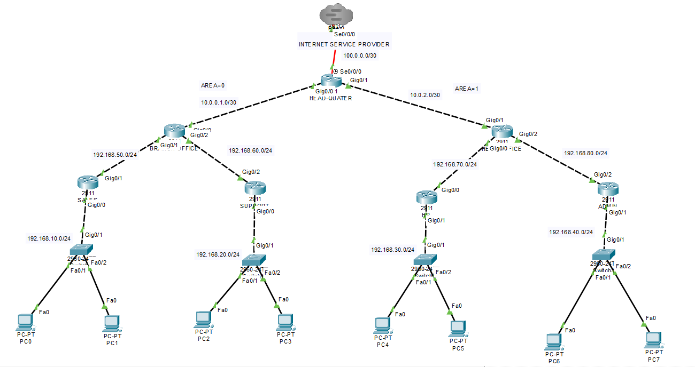

# Networking Lab #10 – Static ↔ OSPF Redistribution (Hybrid Routing Design)

This lab demonstrates a **Hybrid Enterprise Routing Design** where Static Routing and OSPF work together through route redistribution.

The objective is to simulate a real-world network where small branch networks use static routing while the core infrastructure runs dynamic routing using OSPF.

---

## 🧠 Lab Objectives

• Implement Hybrid Routing Design  
• Configure Static Routing in branch networks  
• Configure OSPF Multi-Area Routing  
• Implement Static Route Redistribution into OSPF  
• Simulate Internet connectivity using Default Static Route  
• Verify connectivity across all networks  

---

## Topology

---

## 🌐 Network Overview

The network consists of:

**Headquarter Router (Core Network)**  
Connected to ISP and both OSPF areas.

**Branch Office (Area 0)**  
Contains two static networks redistributed into OSPF.

**Remote Office (Area 1)**  
Contains additional networks connected through OSPF.

---

## 🧭 OSPF Area Design

| Area | Description |
|-----|-------------|
| Area 0 | Backbone Network |
| Area 1 | Remote Branch Networks |

---

## 🌍 IP Addressing Plan

| Network | Purpose |
|-------|---------|
192.168.10.0/24 | Sales LAN  
192.168.20.0/24 | Support LAN  
192.168.30.0/24 | HR LAN  
192.168.40.0/24 | Admin LAN  
192.168.50.0/24 | Branch Link  
192.168.60.0/24 | Support Link  
192.168.70.0/24 | Remote Link  
192.168.80.0/24 | Admin Link  

Backbone Links

10.0.0.0/30  
10.0.2.0/30  

ISP Network

100.0.0.0/30

---

## ⚙️ Routing Technologies Used

### Static Routing
Used in branch routers for simple LAN connectivity.

### OSPF Multi-Area
Used in the core network for dynamic routing scalability.

### Route Redistribution
Static routes injected into OSPF domain.

### Default Static Route
Simulates internet connectivity through ISP.

---

## 🔧 Key Configuration

### Static Route Redistribution
router ospf 1
redistribute static subnets

### Default Static Route (Internet)
ip route 0.0.0.0 0.0.0.0 100.0.0.1

---

## 🔍 Verification Commands
show ip route
show ip ospf neighbor
show ip protocols
show ip ospf database
traceroute <destination-ip>
ping <destination-ip>

---

## 📈 Expected Results

✔ OSPF neighbors reach FULL state  
✔ Static routes appear in routing table as **O E2 routes**  
✔ End-to-end connectivity across all LANs  
✔ Internet route available via default route  

---

## 🎯 Key Learning Outcomes

• Understanding Hybrid Routing Design  
• Implementing Static → OSPF Redistribution  
• Simulating ISP connectivity  
• Designing scalable enterprise networks  

---

## 🧑‍💻 Author
**Shivam Kumar Sinha**

GitHub
https://github.com/Shivam-azure-network-labs

Part of my **CCNA Networking Labs Series** where I practice real-world networking scenarios.
