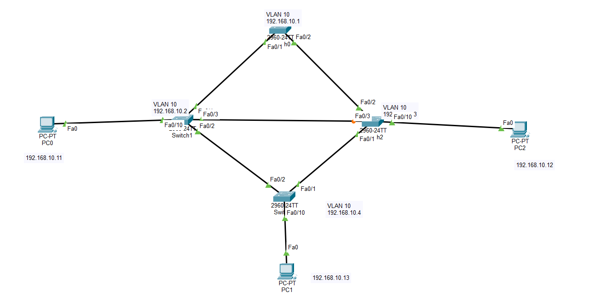

# CCNA Lab 11 – Spanning Tree Protocol (STP) | Root Bridge Election

## Lab Overview
This lab demonstrates the configuration and verification of Spanning Tree Protocol (STP) to prevent Layer-2 switching loops in a redundant network topology.

A topology with multiple interconnected switches was created. STP automatically elects a Root Bridge and blocks redundant paths to maintain a loop-free network.

---

## Topology

• SW1 is configured as the **Root Bridge**  
• SW2 acts as **Root Secondary**  
• Redundant links are used to demonstrate **STP loop prevention**

---

## IP Addressing (Management VLAN)

| Device | VLAN | IP Address |
|------|------|-----------|
| SW1 | VLAN10 | 192.168.10.1 |
| SW2 | VLAN10 | 192.168.10.2 |
| SW3 | VLAN10 | 192.168.10.3 |
| SW4 | VLAN10 | 192.168.10.4 |

Subnet Mask

255.255.255.0

---

## Key Concepts Practiced

• Spanning Tree Protocol (STP)  
• Root Bridge Election  
• Root Port Identification  
• Designated Ports  
• PortFast Configuration  
• BPDU Guard Protection  
• Layer-2 Loop Prevention

---

## Verification Commands

show spanning-tree vlan 10  
show spanning-tree interface fa0/10 detail  
show vlan brief  
show interfaces trunk

---

## Lab Results

✔ Root Bridge successfully elected (SW1)  
✔ Root Port identified on non-root switches  
✔ Redundant links controlled by STP  
✔ PortFast enabled on access ports  
✔ End-to-end connectivity verified using ping

---

## Author

**Shivam Kumar Sinha**

GitHub Repository  
https://github.com/Shivam-azure-network-labs/-Networking-Labs.git

LinkedIn Profile  
https://linkedin.com/in/shivam-kumar-sinha-0a9248308
