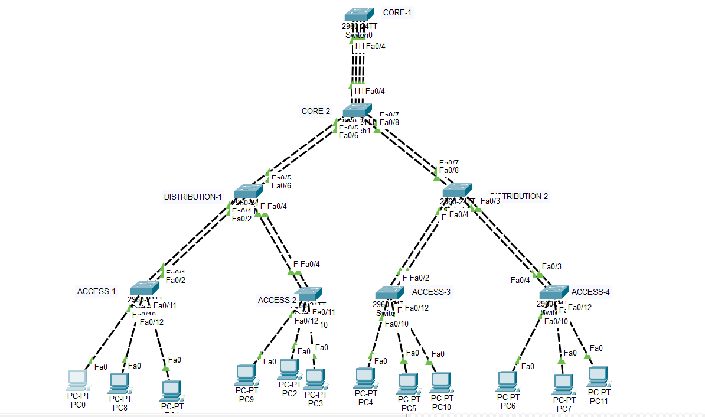

# CCNA Lab #12 – EtherChannel (LACP / PAgP) Link Aggregation

## Lab Overview
This lab demonstrates the implementation of **EtherChannel Link Aggregation** in an enterprise-style switching environment using Cisco Packet Tracer.

EtherChannel allows multiple physical links between switches to be bundled into a single logical link, increasing bandwidth and providing redundancy.

In this topology, both **LACP (IEEE standard)** and **PAgP (Cisco proprietary)** protocols are implemented to form EtherChannel connections between different layers of the network.

---

## Network Architecture

This lab follows a **3-Tier Enterprise Network Design**:

- **Core Layer**
  - CORE-1
  - CORE-2

- **Distribution Layer**
  - DISTRIBUTION-1
  - DISTRIBUTION-2

- **Access Layer**
  - ACCESS-1
  - ACCESS-2
  - ACCESS-3
  - ACCESS-4

Each access switch connects multiple PCs segmented using VLANs.

---

## Topology

---

## VLAN Configuration

| VLAN | Name |
|-----|------|
| 10 | HR |
| 20 | SALES |
| 30 | IT |

These VLANs are created on all switches to maintain consistent VLAN propagation across trunk links.

---

## EtherChannel Implementation

| Connection | Protocol | Ports |
|-------------|-----------|-------|
| CORE-1 ↔ CORE-2 | LACP | Fa0/1–Fa0/4 |
| CORE-2 ↔ DISTRIBUTION-1 | LACP | Fa0/5–Fa0/6 |
| CORE-2 ↔ DISTRIBUTION-2 | LACP | Fa0/7–Fa0/8 |
| DISTRIBUTION-1 ↔ ACCESS-1 | PAgP | Fa0/1–Fa0/2 |
| DISTRIBUTION-1 ↔ ACCESS-2 | PAgP | Fa0/3–Fa0/4 |
| DISTRIBUTION-2 ↔ ACCESS-3 | PAgP | Fa0/1–Fa0/2 |
| DISTRIBUTION-2 ↔ ACCESS-4 | PAgP | Fa0/3–Fa0/4 |

---

## Key Concepts Demonstrated

- EtherChannel Link Aggregation
- LACP (Link Aggregation Control Protocol)
- PAgP (Port Aggregation Protocol)
- VLAN Segmentation
- Trunk Links Between Switches
- Redundant Enterprise Switching Design

---

## Verification Commands

### Check EtherChannel Status
show etherchannel summary

### Verify VLAN Configuration
show vlan brief

### Verify Trunk Links
show interfaces trunk

---

## Expected EtherChannel Output

Example:
Group Port-channel Protocol Ports
1 Po1(SU) LACP Fa0/1 Fa0/2 Fa0/3 Fa0/4
2 Po2(SU) LACP Fa0/5 Fa0/6
3 Po3(SU) LACP Fa0/7 Fa0/8

Legend:

- **S** – Layer2 EtherChannel
- **U** – Channel in use
- **P** – Port bundled in port-channel

---

## Lab Objectives

- Configure EtherChannel using both **LACP and PAgP**
- Implement VLAN segmentation across the network
- Establish trunk links between switches
- Verify EtherChannel bundle status and operation

---

## Tools Used

- Cisco Packet Tracer
- Cisco Catalyst 2960 Switches

---

## Author

**Shivam Kumar Sinha**

Networking Enthusiast | CCNA Labs Builder

GitHub Repository:  
https://github.com/Shivam-azure-network-labs/-Networking-Labs.git
LinkedIn:
https://www.linkedin.com/in/shivam-kumar-sinha-0a9248308/overlay/contact-info/

---

## License

This project is created for educational and learning purposes.
