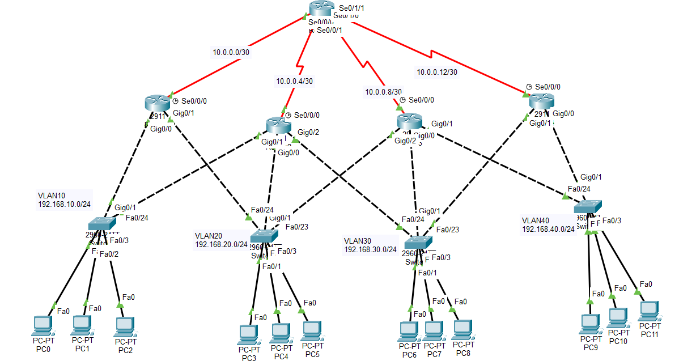

# CCNA Lab 13 – HSRP + OSPF Redundant Network

## Overview
This lab demonstrates a small enterprise network design implementing gateway redundancy and dynamic routing.

The goal of this lab is to ensure network availability even if one router fails.

Technologies used:
- VLAN Segmentation
- Inter-VLAN Routing
- HSRP (Hot Standby Router Protocol)
- OSPF Dynamic Routing
- Trunk Links
- WAN Serial Connectivity

---

## Topology

---

## Network Topology

Core Router connects four access routers through serial links.

Each access router provides gateway redundancy for different VLAN networks.

VLAN Networks:
- VLAN10 – HR – 192.168.10.0/24
- VLAN20 – SALES – 192.168.20.0/24
- VLAN30 – IT – 192.168.30.0/24
- VLAN40 – SUPPORT – 192.168.40.0/24

WAN Networks:
- 10.0.0.0/30
- 10.0.0.4/30
- 10.0.0.8/30
- 10.0.0.12/30

---

## Features Implemented

### VLAN Segmentation
Department-based VLAN segmentation for better network organization.

### Trunk Links
Switch-to-switch trunk links using 802.1Q encapsulation.

### HSRP Gateway Redundancy
HSRP configured between access routers to provide a virtual default gateway.

Example Virtual Gateways:

VLAN10 → 192.168.10.1  
VLAN20 → 192.168.20.1  
VLAN30 → 192.168.30.1  
VLAN40 → 192.168.40.1  

### OSPF Routing
All routers participate in OSPF Area 0 to exchange routing information.

---

## Verification Commands
show vlan brief
show interfaces trunk
show standby brief
show ip ospf neighbor
show ip route

---

## Failover Testing

To verify redundancy:

1. Shutdown active HSRP router interface
2. Observe standby router becoming active
3. Test connectivity using ping

---

## Learning Outcome

This lab demonstrates how redundancy protocols like HSRP combined with dynamic routing protocols like OSPF can create highly available enterprise networks.

---

## 🧑‍💻 Author

Shivam Kumar Sinha

GitHub
https://github.com/Shivam-azure-network-labs

Part of my CCNA Networking Labs Series where I practice real-world networking scenarios.
