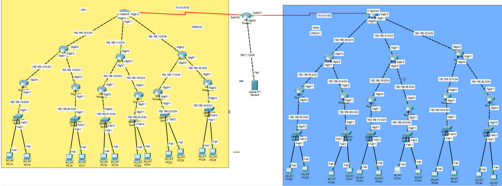

# CCNA Lab 14- Multi-Branch Enterprise Network Lab (USA 🇺🇸 & India 🇮🇳)

---

## 📌 Project Overview
This project simulates a real-world enterprise network with multiple departments across two countries (USA and India), interconnected via an ISP.

---
## Topology

---

# 🏢 USA BRANCH STRUCTURE

## 🧠 Main Router
- **USA-BRANCH**

---

## 📡 Department Routers & Networks

| Router Name        | Department      | Interface | Network          | Gateway        |
|-------------------|----------------|----------|------------------|----------------|
| USA-HR            | HR             | G0/0     | 192.168.10.0/24  | 192.168.10.1   |
| USA-FINANCE       | Finance        | G0/0     | 192.168.11.0/24  | 192.168.11.1   |
| USA-SALES         | Sales          | G0/0     | 192.168.12.0/24  | 192.168.12.1   |
| USA-IT            | IT             | G0/0     | 192.168.13.0/24  | 192.168.13.1   |
| USA-R&D           | R&D            | G0/0     | 192.168.14.0/24  | 192.168.14.1   |
| USA-SUPPORT       | Support        | G0/0     | 192.168.15.0/24  | 192.168.15.1   |
| USA-MANAGEMENT    | Management     | G0/0     | 192.168.16.0/24  | 192.168.16.1   |
| USA-SECURITY      | Security       | G0/0     | 192.168.17.0/24  | 192.168.17.1   |
| USA-DATACENTER    | Data Center    | G0/0     | 192.168.18.0/24  | 192.168.18.1   |

---

# 🏢 INDIA BRANCH STRUCTURE

## 🧠 Main Router
- **INDIA-BRANCH**

---

## 📡 Department Routers & Networks

| Router Name        | Department      | Interface | Network          | Gateway        |
|-------------------|----------------|----------|------------------|----------------|
| INDIA-HR          | HR             | G0/0     | 192.168.30.0/24  | 192.168.30.1   |
| INDIA-FINANCE     | Finance        | G0/0     | 192.168.31.0/24  | 192.168.31.1   |
| INDIA-SALES       | Sales          | G0/0     | 192.168.32.0/24  | 192.168.32.1   |
| INDIA-IT          | IT             | G0/0     | 192.168.33.0/24  | 192.168.33.1   |
| INDIA-R&D         | R&D            | G0/0     | 192.168.34.0/24  | 192.168.34.1   |
| INDIA-SUPPORT     | Support        | G0/0     | 192.168.35.0/24  | 192.168.35.1   |
| INDIA-MANAGEMENT  | Management     | G0/0     | 192.168.36.0/24  | 192.168.36.1   |
| INDIA-SECURITY    | Security       | G0/0     | 192.168.37.0/24  | 192.168.37.1   |
| INDIA-DATACENTER  | Data Center    | G0/0     | 192.168.38.0/24  | 192.168.38.1   |

---

# 🌐 WAN CONNECTIVITY

| Link            | Network        |
|-----------------|---------------|
| USA ↔ ISP       | 10.0.0.0/30   |
| INDIA ↔ ISP     | 10.0.0.4/30   |

---

# 🌍 PUBLIC NAT NETWORKS

| Country | NAT Type        | Public IP Range          |
|--------|----------------|--------------------------|
| USA    | Static NAT     | 200.2.2.10               |
| INDIA  | Dynamic NAT    | 200.1.1.50 – 200.1.1.60  |

---

# 🔁 ROUTING DESIGN

- OSPF used inside branches
- Static routing used on ISP
- Default route configured on branches

---

# 🔐 NAT CONFIGURATION

## 🇺🇸 USA
- Static NAT:
  - 192.168.23.10 → 200.2.2.10

## 🇮🇳 INDIA
- Dynamic NAT (PAT):
  - ACL-based translation
  - NAT Pool: 200.1.1.50–60

---

# ✅ VERIFICATION

- ✔ End-to-End Ping Successful
- ✔ NAT Translation Working
- ✔ Routing Verified

---

# 🧠 KEY LEARNINGS

- Multi-branch enterprise design
- NAT (Static vs Dynamic)
- Routing + NAT interaction
- Real-world troubleshooting

---

# 🚀 FUTURE IMPROVEMENTS

- ACL Security
- Failover (IP SLA)
- BGP Implementation

---

## 🧑‍💻 Author

Shivam Kumar Sinha

GitHub
https://github.com/Shivam-azure-network-labs

Part of my CCNA Networking Labs Series where I practice real-world networking scenarios.
