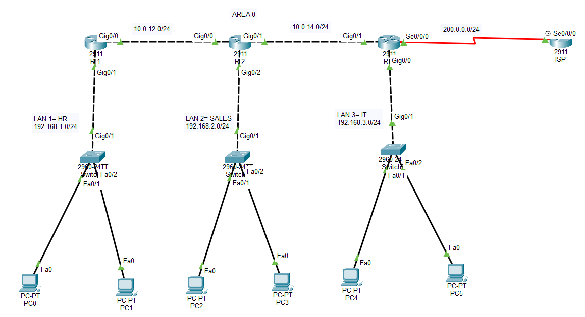

# CCNA Lab 5 – Default Route Advertisement in OSPF

## Lab Objective

This lab demonstrates how to **advertise a default route in OSPF** so that internal routers can access external networks (simulated Internet).

In enterprise networks, the edge router connected to the ISP injects a **default route (0.0.0.0/0)** into the OSPF domain.
All internal routers then forward unknown traffic toward that edge router.

---

# Network Topology



---

# Network Addressing

| Device | Interface | IP Address     |
| ------ | --------- | -------------- |
| R1     | G0/0      | 10.0.12.1/24   |
| R1     | G0/1      | 192.168.1.1/24 |
| R2     | G0/0      | 10.0.12.2/24   |
| R2     | G0/1      | 10.0.14.1/24   |
| R2     | G0/2      | 192.168.2.1/24 |
| R3     | G0/1      | 10.0.14.2/24   |
| R3     | G0/0      | 192.168.3.1/24 |
| R3     | S0/0/0    | 200.0.0.2/24   |
| ISP    | S0/0/0    | 200.0.0.1/24   |

---

# LAN Networks

| Network        | Department |
| -------------- | ---------- |
| 192.168.1.0/24 | HR         |
| 192.168.2.0/24 | SALES      |
| 192.168.3.0/24 | IT         |

---

# What I Practiced

• OSPF configuration across multiple routers
• OSPF neighbor adjacency formation
• Static default route configuration
• Default route advertisement into OSPF
• External route propagation in OSPF
• End-to-End connectivity verification

---

# Key Concept

Routers inside an OSPF network normally know only **internal routes**.

To allow access to external networks (Internet), an edge router creates a **static default route**:

```
ip route 0.0.0.0 0.0.0.0 200.0.0.1
```

Then it injects the route into OSPF:

```
default-information originate
```

Other routers learn the route as:

```
O*E2 0.0.0.0/0
```

Where:

* **O** → OSPF route
* **E2** → External route type 2
* ***** → Candidate default route

---

# Verification Commands

```
show ip route
show ip ospf neighbor
show ip ospf database
show running-config | section ospf
```

---

# Connectivity Test

From any internal PC:

```
ping 200.0.0.1
```

After OSPF convergence, the ping should succeed.

---

# Learning Outcome

This lab demonstrates how **default route advertisement simplifies routing in enterprise networks**.
Instead of configuring external routes on every router, a single edge router distributes the default route across the OSPF domain.

---

# Author

**Shivam Kumar Sinha**
CCNA Networking Labs
GitHub: Shivam-azure-network-labs
