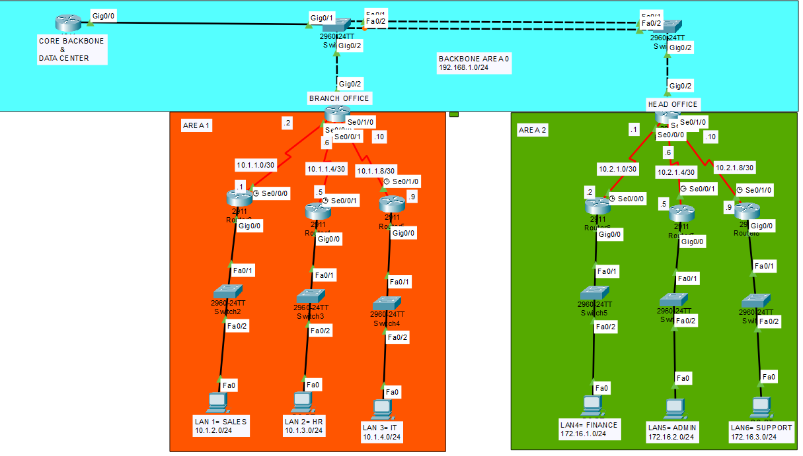

## CCNA Lab 08 — Multi-Area OSPF (Area 0, Area 1, Area 2)

## Lab Overview

This lab demonstrates the implementation of **Multi-Area OSPF** in a hierarchical network design.

The topology is divided into **three OSPF areas**:

* **Area 0 (Backbone Area)**
* **Area 1 (Branch Office Networks)**
* **Area 2 (Head Office Networks)**

Area 0 acts as the **central backbone** that connects all other areas.

In enterprise networks, Multi-Area OSPF improves:

* Network scalability
* Routing efficiency
* Faster convergence
* Reduced routing table size

This lab focuses on **Area Border Routers (ABR)** which connect non-backbone areas to the backbone.

---

## Topology

---

## Network Design

The network is divided into three logical areas.

### Area 0 — Backbone

| Network        | Description                      |
| -------------- | -------------------------------- |
| 192.168.1.0/24 | Backbone network connecting ABRs |

---

### Area 1 — Branch Office

| Network     | Department |
| ----------- | ---------- |
| 10.1.2.0/24 | Sales      |
| 10.1.3.0/24 | HR         |
| 10.1.4.0/24 | IT         |

Serial links used for router connectivity:

* 10.1.1.0/30
* 10.1.1.4/30
* 10.1.1.8/30

---

### Area 2 — Head Office

| Network       | Department |
| ------------- | ---------- |
| 172.16.1.0/24 | Finance    |
| 172.16.2.0/24 | Admin      |
| 172.16.3.0/24 | Support    |

Serial links used for router connectivity:

* 10.2.1.0/30
* 10.2.1.4/30
* 10.2.1.8/30

---

## Key Concepts Practiced

### 1️⃣ OSPF Hierarchical Design

Multi-Area OSPF divides large networks into smaller areas to reduce routing overhead.

---

### 2️⃣ Backbone Area (Area 0)

All OSPF areas must connect to **Area 0**.

Area 0 is responsible for:

* Inter-area communication
* Route exchange between areas

---

### 3️⃣ Area Border Router (ABR)

An ABR is a router that has interfaces in **multiple OSPF areas**.

Responsibilities:

* Connects non-backbone areas to Area 0
* Summarizes routing information
* Propagates inter-area routes

---

### 4️⃣ Inter-Area Routes

Routes learned from another area appear in routing table as:

O IA

These routes are propagated through **Area Border Routers**.

---

## Verification

The following tests were performed:

✔ OSPF neighbors formed successfully
✔ All neighbors reached **FULL state**
✔ Routing table contains **O and O IA routes**
✔ Successful **ping between Area 1 and Area 2 networks**
✔ Traffic path verified using **traceroute**

Example verification commands:

show ip ospf neighbor
show ip ospf interface brief
show ip route
ping <destination-ip>
tracert <destination-ip>

---

## Example Traffic Path

Area 1 → Area 0 → Area 2 → Destination

---

## Skills Practiced

* OSPF Multi-Area Design
* Area Border Router (ABR)
* Inter-Area Routing
* OSPF Neighbor Formation
* Routing Table Verification
* Network Troubleshooting
* End-to-End Connectivity Testing

---

## Tools Used

Cisco Packet Tracer
Cisco IOS CLI

---

## Author

**Shivam Kumar Sinha**

GitHub
https://github.com/Shivam-azure-network-labs

Part of my **CCNA Networking Labs Series** where I practice real-world networking scenarios.
