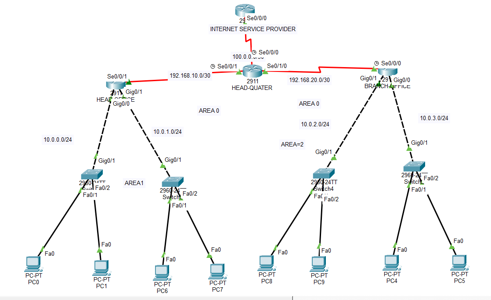

# CCNA Lab 09 – OSPF Route Summarization + ISP Optimization

This lab demonstrates how **OSPF multi-area networks can be optimized using route summarization and default routing through an ISP**.

The goal is to reduce routing table size, improve efficiency, and simulate a real enterprise edge network connected to an ISP.

---

## 🧠 Lab Objectives

- Configure Multi-Area OSPF
- Implement Inter-Area Route Summarization
- Configure ISP Default Route
- Optimize Routing Table
- Verify connectivity using show commands and traceroute

---

## Topology

---

## 🌐 Network Design

### AREA 1 (Branch LANs)

| Network | Department |
|-------|------|
10.0.0.0/24 | LAN1  
10.0.1.0/24 | LAN2  

### AREA 2 (Remote LANs)

| Network | Department |
|-------|------|
10.0.2.0/24 | LAN3  
10.0.3.0/24 | LAN4  

### Backbone Area

192.168.10.0/30  
192.168.20.0/30  

### ISP Link

100.0.0.0/30

---

## 📊 OSPF Area Structure

AREA 0 → Backbone  
AREA 1 → Left Branch Networks  
AREA 2 → Right Branch Networks  

---

## ⚙️ Key Configuration

### OSPF Route Summarization
router ospf 1
area 1 range 10.0.0.0 255.255.254.0
area 2 range 10.0.2.0 255.255.254.0

### Static Default Route to ISP
ip route 0.0.0.0 0.0.0.0 100.0.0.1

---

## 🔎 Verification Commands
show ip ospf neighbor
show ip route
show ip ospf interface brief
show ip protocols
traceroute <destination-ip>

---

## 📈 Expected Results

- OSPF neighbors reach **FULL state**
- Routing table contains summarized **O IA routes**
- Default route **S\*** pointing to ISP
- End-to-end connectivity between Area 1 and Area 2
- Reduced routing table entries

---

## 🎯 What I Learned

- How **OSPF route summarization** improves scalability
- Difference between **Static Default Route vs OSPF Default Injection**
- ISP edge routing concept
- Routing table optimization techniques

---

## 🖼 Lab Topology

Topology designed and tested using **Cisco Packet Tracer**.

---

## 🧑‍💻 Author

Shivam Kumar Sinha

GitHub
https://github.com/Shivam-azure-network-labs

Part of my CCNA Networking Labs Series where I practice real-world networking scenarios.
