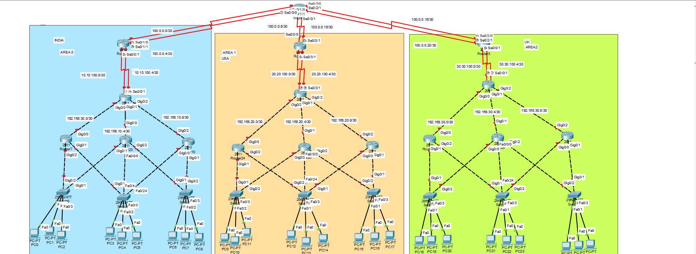

# 🌐 CCNA Lab15- Multi-Country Network using NAT + ACL + OSPF + HSRP

## 📌 Project Overview

This lab simulates a real-world enterprise network connecting three countries (India, USA, UK) through an ISP core network.

The design includes:

* OSPF dynamic routing
* NAT (Pool + Overload)
* ACL-based security
* Redundant WAN links (Primary/Backup)

---

## Topology

---

## 🌍 Network Architecture

### 🏢 Branch Networks

* India → 10.10.0.0/16
* USA → 20.20.0.0/16
* UK → 30.30.0.0/16

### 🌐 ISP Core

* WAN Links → 100.0.0.0/30
* NAT Public Pools:

  * India → 100.0.1.0/24
  * USA → 200.0.1.0/24
  * UK → 150.0.1.0/24

---

## 🧠 Routing Design

### 🔁 OSPF Multi-Area

* India → Area 0 (Backbone)
* USA → Area 1
* UK → Area 2

All branches advertise internal routes using OSPF and inject default route using:
default-information originate

---

## 🌐 ISP Routing (Static + Backup)

Example configuration:
ip route 10.10.0.0 255.255.0.0 100.0.0.2
ip route 10.10.0.0 255.255.0.0 100.0.0.6 10

* Primary path → lower AD
* Backup path → higher AD

---

## 🔥 NAT Configuration

### India

ip nat pool INDIA_POOL 100.0.1.10 100.0.1.50 netmask 255.255.255.0
ip nat inside source list NAT-INDIA pool INDIA_POOL overload

### USA

ip nat pool USA_POOL 200.0.1.10 200.0.1.50 netmask 255.255.255.0
ip nat inside source list NAT-USA pool USA_POOL overload

### UK

ip nat pool UK_POOL 150.0.1.10 150.0.1.50 netmask 255.255.255.0
ip nat inside source list NAT-UK pool UK_POOL overload

---

## 🔐 ACL Security Design

### 🚫 Inter-Country Traffic Blocked

Example (India):
deny ip 10.10.0.0 0.0.255.255 20.20.0.0 0.0.255.255
deny ip 10.10.0.0 0.0.255.255 30.30.0.0 0.0.255.255

---

### ✅ IT Network Full Access

* India → 10.10.30.0/24
* USA → 20.20.30.0/24
* UK → 30.30.30.0/24

Example:
permit ip 10.10.30.0 0.0.0.255 any

---

## 🔄 NAT + ACL Logic

NAT ACL excludes internal/private traffic and allows only internet traffic:

deny ip 10.10.0.0 0.0.255.255 192.168.0.0 0.0.255.255
permit ip 10.10.0.0 0.0.255.255 any

---

## ⚙️ Redundancy Design

* Primary link → OSPF cost 10
* Backup link → OSPF cost 100

Default route backup:
ip route 0.0.0.0 0.0.0.0 100.0.0.x
ip route 0.0.0.0 0.0.0.0 100.0.0.x 10

---

## 🧪 Verification

* show ip route → check routing
* show ip nat translations → check NAT
* ping tests:

❌ Inter-country → blocked
✅ IT VLAN → allowed
✅ Internet → working

---

## 🎯 Key Learning

* Multi-site enterprise network design
* NAT with overload
* Advanced ACL filtering
* OSPF multi-area
* ISP static routing
* Traffic segmentation

---

## 💼 Use Case

* Enterprise WAN design
* Secure branch communication
* ISP integration
* Real CCNA level lab

---

## 🧑‍💻 Author

Shivam Kumar Sinha

---

## 🔗 Links

GitHub: https://github.com/Shivam-azure-network-labs/-Networking-Labs
LinkedIn: https://www.linkedin.com/in/shivam-kumar-sinha-0a9248308/
