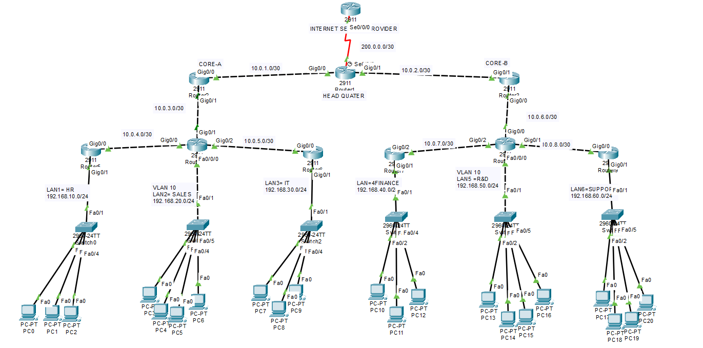

# CCNA Mega Lab — Hybrid Routing + VLAN Design (OSPF + Static Default Route)

## 📌 Overview

This project is a large-scale CCNA practice lab built in Cisco Packet Tracer.
The topology simulates a small enterprise network with multiple departments, VLAN segmentation, dynamic routing, and an ISP connection.

The design combines **OSPF dynamic routing for internal networks** and **static default routing for internet access**, which reflects real enterprise network architecture.

---

## Topology



---

## 🧠 Network Features

* Multi-router enterprise topology
* OSPF dynamic routing between internal routers
* Static default route toward ISP
* VLAN segmentation for departments
* Inter-VLAN routing
* End-to-end connectivity verification
* Hybrid routing design (Dynamic + Static)

---

## 🌐 Network Architecture

Internal networks communicate using **OSPF (Open Shortest Path First)**.

All external traffic is routed toward the **ISP router** using a **static default route**.

```
Internal LANs → OSPF → Core Router → Static Default Route → ISP
```

---

## 🏢 Department VLANs

| Department | VLAN    | Network         |
| ---------- | ------- | --------------- |
| HR         | VLAN 1  | 192.168.10.0/24 |
| Sales      | VLAN 10 | 192.168.20.0/24 |
| IT         | VLAN 20 | 192.168.30.0/24 |
| Finance    | VLAN 30 | 192.168.40.0/24 |
| R&D        | VLAN 40 | 192.168.50.0/24 |
| Support    | VLAN 50 | 192.168.60.0/24 |

---

## 🔗 WAN Links

Router interconnections use **/30 point-to-point networks**

Example:

```
10.0.1.0/30
10.0.2.0/30
10.0.3.0/30
10.0.4.0/30
10.0.5.0/30
10.0.6.0/30
10.0.7.0/30
10.0.8.0/30
```

---

## 🌍 ISP Connection

```
ISP Network: 200.0.0.0/30
```

Static Default Route:

```
ip route 0.0.0.0 0.0.0.0 200.0.0.1
```

---

## ⚙️ Routing Configuration

### OSPF Configuration Example

```
router ospf 1
network 10.0.0.0 0.0.255.255 area 0
network 192.168.0.0 0.0.255.255 area 0
```

---

## 🧪 Troubleshooting Performed

During the lab the following issues were identified and resolved:

* OSPF neighbors not forming
* Incorrect next-hop in static route
* Missing default route
* Ping reaching core but not ISP
* First ping failure due to ARP
* Interface not accepting direct IP address

---

## 💡 Special Scenario

One router module interface did not accept a direct IP address.

Solution:

1. Created a VLAN interface
2. Assigned an IP address to the VLAN
3. Used it as the default gateway for the LAN

This allowed Layer-3 routing to function correctly.

---

## ✔ Final Results

* All routers learned internal routes via OSPF
* Default route successfully directed traffic to ISP
* Full connectivity between all LAN networks
* Stable and loop-free routing achieved

---

## 🛠 Tools Used

* Cisco Packet Tracer
* Basic Cisco IOS CLI
* Networking concepts from CCNA curriculum

---

## 📚 Key Learning

Networking is not just about memorizing commands.
It requires understanding routing logic, gateway flow, and systematic troubleshooting.

---

## Author

**Shivam Kumar Sinha**

GitHub
https://github.com/Shivam-azure-network-labs

Part of my **CCNA Networking Labs Series** where I practice real-world networking scenarios.

